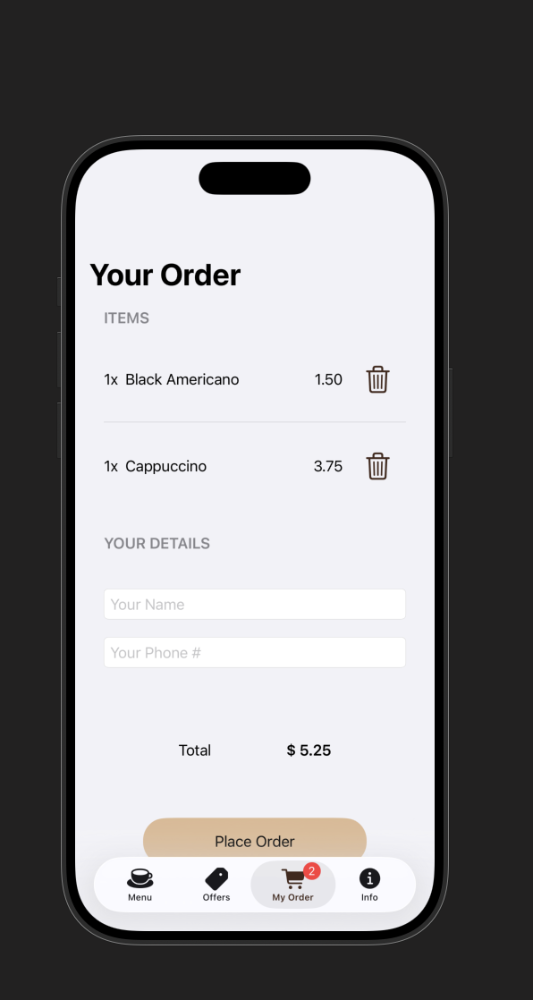
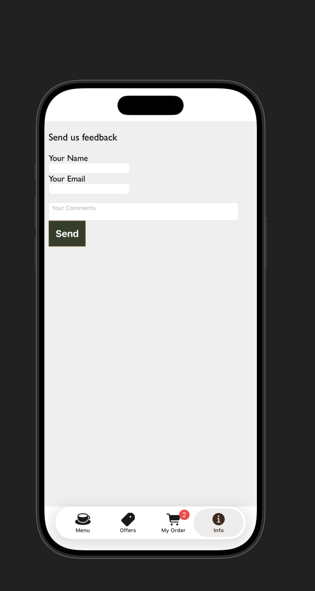

# SwiftUI Course Project

A SwiftUI app built while taking the [Introduction to iOS App Development and Swift](https://frontendmasters.com/courses/swift-ios/) course taught by Maximiliano Firtman on Frontend Masters. After completing the core exercises, I added a few enhancements:
- A Likes feature to favorite items
- A Filters section to quickly narrow results
- An Alert to confirm or inform about important actions

This repository documents what I learned and how to run the app locally.

## Features

- SwiftUI-based UI with state-driven updates
- Basic navigation and list/detail patterns
- Likes: mark/unmark items you enjoy
- Filters: view subsets of items based on text prompts
- Alerts: confirm actions or show contextual messages

## What I learned

- Xcode essentials: creating and opening projects, using the simulator, previews, and the debugger
- Swift basics: optionals, structs, properties, functions, and simple data models
- SwiftUI concepts: views, modifiers, state (`@State`, `@EnvironmentObject`), reactive updates, and composition
- Project organization and iterative development (build → run → refine)
- Bridging UIKit with SwiftUI using `UIViewRepresentable` to embed a WebView on the Info page
- Using external libraries with Swift Package Manager (SPM): added Alamofire (5.10.2) and imported it to perform simple network requests
- Networking with Alamofire: fetching JSON via `AF.request`, decoding with `JSONDecoder`, and updating `@Published` state on the main actor (see `CoffeeMasters/Model/MenuManager.swift`)
- Debugging a SwiftUI threading warning: fixed “Publishing changes from background threads is not allowed” by ensuring assignments to `@Published` properties occur on the main actor (e.g., `Task { @MainActor in ... }`). I shared a quick write-up here: [My X post on the debugging process](https://twitter.com/1804davey/status/1980522212626214934)

## Networking with Alamofire

This project uses [Alamofire](https://github.com/Alamofire/Alamofire) for simple URL fetching of the menu JSON and updating the UI with the decoded data.

- Dependency: Added via Swift Package Manager (Alamofire 5.10.2).
- Endpoint: `https://firtman.github.io/coffeemasters/api/menu.json`
- Implementation location: `CoffeeMasters/Model/MenuManager.swift`

Key code:

```swift
import Alamofire

class MenuManager: ObservableObject {
    @Published var menu: [Category] = []
    
    init() {
        refreshItemsFromNetwork()
    }
    
    func refreshItemsFromNetwork() {
        AF.request("https://firtman.github.io/coffeemasters/api/menu.json")
            .responseData { response in
                if let data = response.value {
                    let decoder = JSONDecoder()
                    if let menuFromNetwork = try? decoder.decode([Category].self, from: data) {
                        Task { @MainActor in
                            self.menu = menuFromNetwork
                        }
                    }
                }
            }
    }
}
```

How it works:

- `AF.request` performs a GET request to the menu API.
- The `.responseData` handler receives the raw `Data`.
- `JSONDecoder` decodes the payload into `[Category]`.
- The result is assigned to the `@Published` `menu` property on the main actor so SwiftUI updates the UI automatically.

Notes and ideas for extension:

- Add `.validate()` to surface HTTP errors, and handle failures in the response closure.
- Consider modeling errors and loading states to improve UX (e.g., progress indicators, retry).
- You can extract the network layer if needed, but for this project the inline use keeps things simple.

## Requirements

- macOS with the latest stable Xcode (Xcode 15+ recommended)
- iOS 17+ simulator or a physical device running a compatible iOS version
- Swift and SwiftUI included with your Xcode installation

## Getting started

### 1) Clone the repository

Replace the URL below with your repository URL.

```bash
# HTTPS (example)
git clone https://github.com/DaveyEke/<this-repo>.git

# or using SSH (example)
git clone git@github.com:DaveyEke/<this-repo>.git
```

```bash
cd <this-repo>
```

### 2) Open in Xcode

- Double-click the `.xcodeproj` or `.xcworkspace` file, or open from Xcode’s Welcome screen.
- Select a simulator (e.g., iPhone 15) or a connected device.

### 3) Build and run

- Press Cmd+R (or click the Run button in Xcode) to build and run the app.
- If prompted for signing, use your Apple ID in Xcode > Settings > Accounts and set a team in the target’s Signing & Capabilities.

## Project structure (high level)

- Models: Lightweight data structures used by the views
- Views: SwiftUI views for list, details, filters, and alerts
- Resources: Assets, images, and app metadata

Note: The exact structure may vary depending on your course checkpoints and extra features added.

## Usage notes

- Likes: Tap the Like button to favorite an item; tap again to unlike.
- Filters: Open the Filters view (e.g., via toolbar or navigation) and choose a filter to narrow results.
- Alerts: Certain actions may prompt confirmation or display contextual information.

## Screenshots and images

- Images live under `docs/images/`.






## Roadmap / ideas

- More iOS 26 designs
- Link Previews, Context Menus
- Basic unit/UI tests

## Acknowledgments

- Course: [Introduction to iOS App Development and Swift](https://frontendmasters.com/courses/swift-ios/) by Maximiliano Firtman
- Platform: Frontend Masters
- Apple Developer Documentation for Swift and SwiftUI

## License

This project is licensed under the MIT License.
