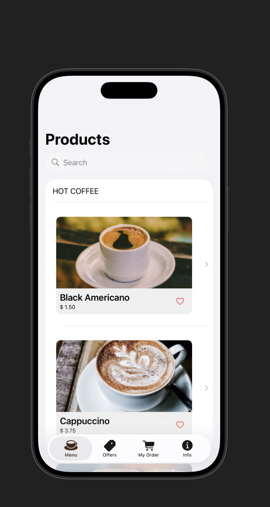
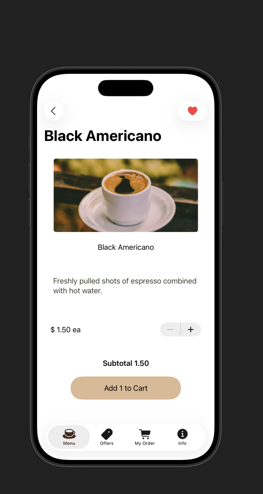
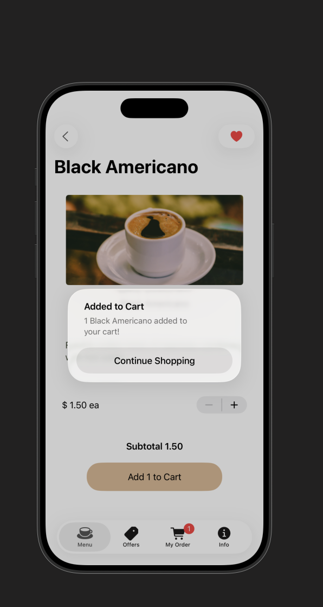

# SwiftUI Course Project

A SwiftUI app built while taking the [Introduction to iOS App Development and Swift](https://frontendmasters.com/courses/ios-swift/) course taught by Maximiliano Firtman on Frontend Masters. After completing the course’s core project, I went further by adding:
- A Likes feature to favorite items
- A Filters section to quickly narrow results
- An Alert to confirm or inform about important actions

This repository documents what I learned and how to run the app locally.

## Features

- SwiftUI-based UI with state-driven updates
- Basic navigation and list/detail patterns
- Likes: mark/unmark items you enjoy
- Filters: view subsets of items based on text prompts
- Alerts: confirm actions or show contextual messages

## What I learned

- Xcode essentials: creating and opening projects, using the simulator, previews, and the debugger
- Swift basics: optionals, structs, properties, functions, and simple data models
- SwiftUI concepts: views, modifiers, state (`@State`, `@EnvironmentObject`), reactive updates, and composition
- Project organization and iterative development (build → run → refine)

## Requirements

- macOS with the latest stable Xcode (Xcode 15+ recommended)
- iOS 17+ simulator or a physical device running a compatible iOS version
- Swift and SwiftUI included with your Xcode installation

## Getting started

### 1) Clone the repository

Replace the URL below with your repository URL.

```bash
# HTTPS (example)
git clone https://github.com/DaveyEke/<this-repo>.git

# or using SSH (example)
git clone git@github.com:DaveyEke/<this-repo>.git
```

```bash
cd <this-repo>
```

### 2) Open in Xcode

- Double-click the `.xcodeproj` or `.xcworkspace` file, or open from Xcode’s Welcome screen.
- Select a simulator (e.g., iPhone 15) or a connected device.

### 3) Build and run

- Press Cmd+R (or click the Run button in Xcode) to build and run the app.
- If prompted for signing, use your Apple ID in Xcode > Settings > Accounts and set a team in the target’s Signing & Capabilities.

## Project structure (high level)

- Models: Lightweight data structures used by the views
- Views: SwiftUI views for list, details, filters, and alerts
- Resources: Assets, images, and app metadata

Note: The exact structure may vary depending on your course checkpoints and extra features added.

## Usage notes

- Likes: Tap the Like button to favorite an item; tap again to unlike.
- Filters: Open the Filters view (e.g., via toolbar or navigation) and choose a filter to narrow results.
- Alerts: Certain actions may prompt confirmation or display contextual information.

## Screenshots and images

Add images to the `docs/images` folder (create it if it doesn’t exist), then link to them here:

```md





```

If you prefer hosting images elsewhere, paste the external links:

```md

```

## Roadmap / ideas

- Persist Likes across app launches (e.g., UserDefaults, or a database)
- More advanced filtering (multiple criteria, search, tokens)
- Accessibility enhancements (VoiceOver labels, Dynamic Type)
- Theming and custom styles
- Basic unit/UI tests

## Acknowledgments

- Course: [Introduction to iOS App Development and Swift](https://frontendmasters.com/courses/ios-swift/) by Maximiliano Firtman
- Platform: Frontend Masters
- Apple Developer Documentation for Swift and SwiftUI

## License

This project is licensed under the MIT License. See [LICENSE](LICENSE) for details.
